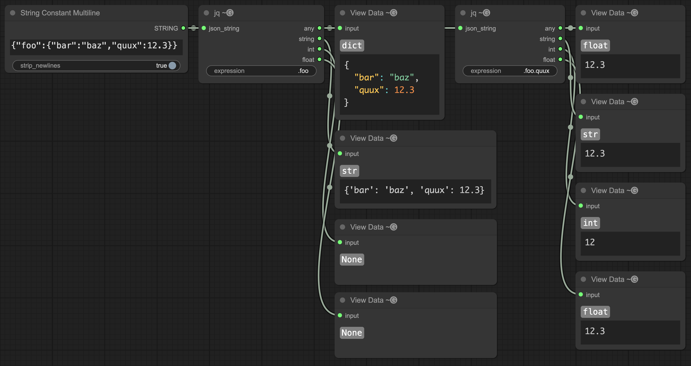

# ComfyUI-jq

A ComfyUI node that runs a [jq](https://jqlang.github.io/jq/) query against input JSON and outputs the result.



## Installation

### ComfyUI-Manager

- Open the Manager
- Pick "Custom Nodes Manager"
- Search for "ComfyUI-jq"
- Install the latest version
- Restart ComfyUI

### Comfy-Cli

- Run `comfy node install comfyui-jq`
- Restart ComfyUI

### Manual

Run the following commands in the terminal:

```shell
cd custom_nodes
git clone https://github.com/Gremlation/ComfyUI-jq
pip install -r ComfyUI-jq/requirements.txt
```

Then restart ComfyUI.
